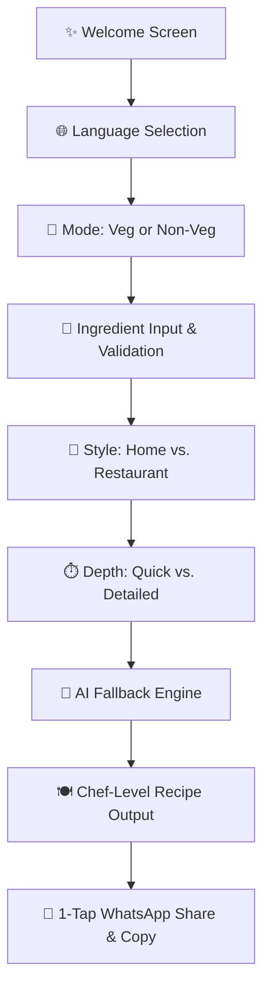

<p align="center">
  
</p>

<h1 align="center">Tastemaker AI 🍽️</h1>

<p align="center">
  <strong>Your Personal AI Chef for Traditional Indian Cooking</strong><br>
  <em>Cook Smart. Cook Fresh. Har Recipe, Chef Level.</em>
</p>

<p align="center">
  <a href="https://flutter.dev"></a>
  <a href="https://dart.dev"></a>
  <a href="https://openrouter.ai"></a>
  <a href="https://android.com"></a>
  <a href="#license"></a>
</p>

---

## 🌟 Highlights & Features

- 🥦 **Smart Ingredient Input**: Strict veg/non-veg mode rules with real-time validation and keyword analysis.
- 🏠 **Tailored Cooking Styles**: Choose between authentic **Home Style** or rich **Restaurant Style** preparations.
- ⚡ **Adjustable Recipe Depth**: Toggle between **Quick (under 30 mins)** or **Detailed Chef-Level** step-by-step masterclasses.
- 🤖 **Resilient Multi-Model AI Fallback**: OpenRouter integration with automated multi-model cascade for 99.9% recipe generation reliability.
- 📊 **Nutritional Insights**: Accurate estimations for Calories, Protein, Carbs, Fat, and Dietary Fiber.
- 📱 **1-Tap WhatsApp Sharing**: Share formatted recipes directly to friends and family.
- 🎨 **Adaptive Branding**: Emerald Green visual design with adaptive Android launcher icons (`API 26+`) and smooth animations.
- 🔒 **Secure by Design**: Zero hardcoded keys in source; configured safely via compile-time `--dart-define`.

---

## 📱 User Workflow



---

## 🚀 Quick Start Guide

### Prerequisites
- [Flutter SDK](https://docs.flutter.dev/get-started/install) (v3.10.4 or newer)
- [Dart SDK](https://dart.dev/get-dart) (v3.x)
- Android Studio / VS Code with Flutter extensions
- An [OpenRouter](https://openrouter.ai) API key (free tier available)

### Installation & Run

1. **Clone the Repository**
   ```bash
   git clone https://github.com/your-username/tastemaker-ai.git
   cd "tastemaker-ai"
   ```

2. **Install Flutter Dependencies**
   ```bash
   flutter pub get
   ```

3. **Run the App with your API Key**
   ```bash
   flutter run --dart-define=OPENROUTER_API_KEY="your_openrouter_api_key_here"
   ```

> **Security Note**: Never commit API keys to version control. Keys are injected at build/run time using `--dart-define=OPENROUTER_API_KEY=...`.

---

## 📦 Production Release Builds

### 1. Build Obfuscated Android APK (Direct Install)
```bash
flutter build apk --release \
  --dart-define=OPENROUTER_API_KEY="your_openrouter_api_key_here" \
  --obfuscate \
  --split-debug-info=build/debug-info
```
*Output path: `build/app/outputs/flutter-apk/app-release.apk`*

### 2. Build Android App Bundle (Google Play Store)
```bash
flutter build appbundle --release \
  --dart-define=OPENROUTER_API_KEY="your_openrouter_api_key_here" \
  --obfuscate \
  --split-debug-info=build/debug-info
```
*Output path: `build/app/outputs/bundle/release/app-release.aab`*

### 3. Generate Platform Launcher Icons
```bash
dart run flutter_launcher_icons
```

---

## 🏗️ Project Architecture

```
tastemaker_ai/
├── android/                   # Native Android host configuration
│   └── app/src/main/res/      # Adaptive & legacy mipmap densities (mdpi to xxxhdpi)
├── assets/
│   └── icon/                  # Master 1024x1024 icons & adaptive foregrounds
├── lib/
│   ├── config/
│   │   ├── app_config.dart    # Model configurations & metadata
│   │   └── env.dart           # Safe dart-define environment handler
│   ├── models/
│   │   ├── recipe.dart        # Structured recipe & nutrition model
│   │   └── recipe_request.dart# User input parameters model
│   ├── providers/
│   │   └── app_state.dart     # Central state management (ChangeNotifier)
│   ├── screens/               # Flutter UI Screens (Welcome, Modes, Output, etc.)
│   ├── services/
│   │   ├── openrouter_service.dart # Multi-model fallback client
│   │   └── recipe_generator.dart   # Prompt orchestration
│   ├── theme/
│   │   └── app_theme.dart     # Brand theme, typography & palette
│   ├── utils/
│   │   ├── ingredient_validator.dart # Veg/Non-veg guardrails
│   │   ├── prompt_builder.dart       # Structured JSON system prompts
│   │   └── share_helper.dart         # WhatsApp share formatting
│   └── main.dart              # App initialization & navigation root
└── pubspec.yaml               # Dependencies & asset declarations
```

---

## 🤖 Multi-Model AI Fallback Architecture

To ensure high availability on free tier quotas, Tastemaker AI utilizes an automated fallback sequence across verified models:

1. `liquid/lfm-2.5-1.2b-instruct:free` (Ultra-low latency primary)
2. `stepfun/step-3.5-flash:free` (High-accuracy fallback)
3. `mistralai/mistral-7b-instruct:free` (Standard culinary reasoning)
4. `google/gemini-2.0-flash-lite-preview-02-05:free` (Multilingual powerhouse)
5. `openrouter/free` (Auto-routing safety net)

---

## 🎨 Design System

| Token | Hex Code | Purpose |
| :--- | :--- | :--- |
| **Forest Green** | `#2E7D32` | Primary branding, buttons, app bar |
| **Fresh Green** | `#337350` | Adaptive icon background, highlights |
| **Light Cream** | `#FFF8E1` | Background canvas, recipe cards |
| **Warm Orange** | `#FF6F00` | Call to action, cooking time accents |
| **Mint Accent** | `#81C784` | Badges, vegetarian indicators |

---

## 📄 License

This project is open source and available under the [MIT License](LICENSE).

---

<p align="center">
  Made with ❤️ for food lovers and home cooks worldwide.<br>
  <strong>Tastemaker AI</strong> — <em>Authentic Indian Flavors, Reimagined.</em>
</p>
